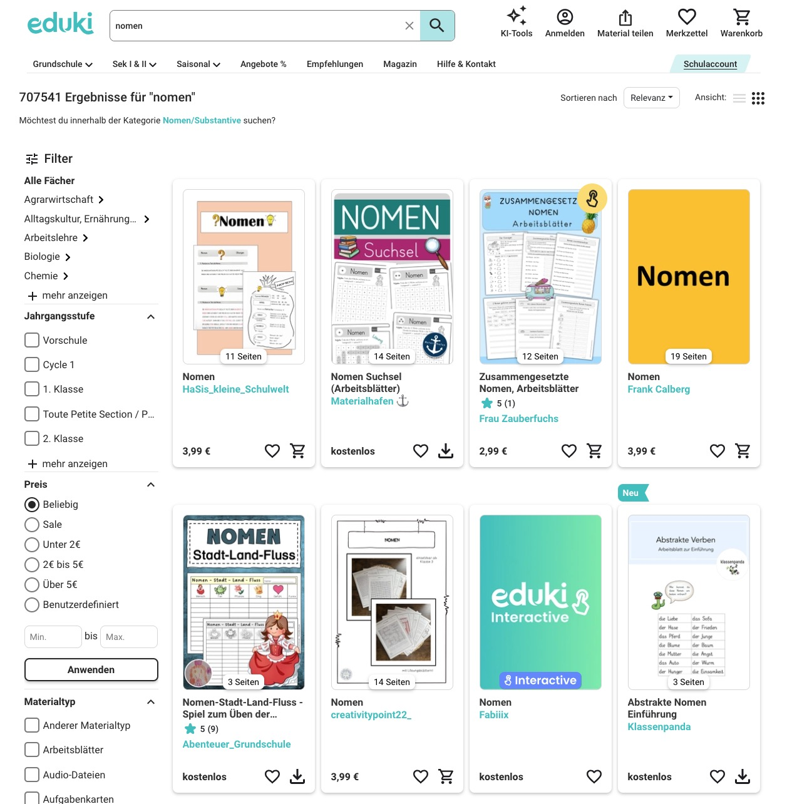
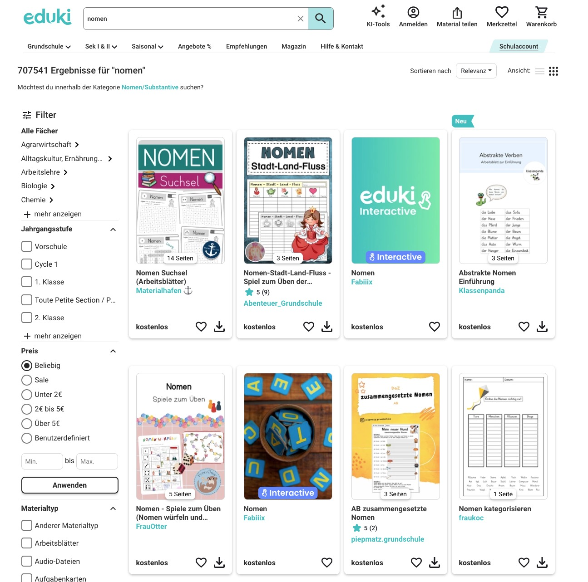

# Instructions (in German)
## Download Anleitung
1. Klicke auf die grüne Schaltfläche `<> Code`.
1. Klicke auf *Download Zip*.
1. Speichere die Zip Datei auf deinem Gerät (kann später gelöscht werden).
1. Extrahiere die Zip Datei.
1. Öffne Google Chrome.
1. Klicke auf die drei Punkte oben rechts -> Klicke auf *Erweiterungen*.
1. Schalte den *Entwicklermodus* an (Schieber oben rechts auf blau).
1. Klicke auf *Entpackte Erweiterung laden*.
1. Wähle den Ordner "eduki-free-filter-main" aus (Achtung: nicht die Zip-Datei).

## Hinweis
Mit dieser Erweiterung wird kostenpflichtiges Material auf Eduki nicht angezeigt. Manchmal muss mehrmals auf "Mehr anzeigen" geklickt werden, um kostenloses Material zu sehen.

| Ohne Erweiterung | Mit Erweiterung |
| --- | ---|
|  | |